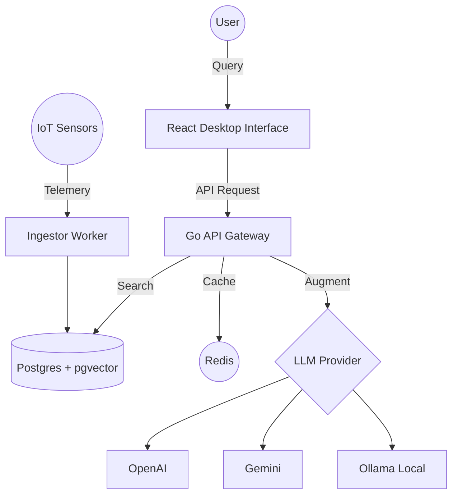

# 🌐 IoT-RAG Command Center

[](https://golang.org)
[](https://reactjs.org)
[](https://tailwindcss.com)
[](https://opensource.org/licenses/MIT)

> A premium, high-performance Retrieval-Augmented Generation (RAG) platform tailored for IoT telemetry data. Experience futuristic data interaction with real-time analysis and intelligent insights.

---

## ✨ Features

- 🚀 **High-Performance RAG**: Leveraging `pgvector` for efficient vector similarity search.
- 🧠 **Hybrid LLM Support**: Seamlessly switch between **OpenAI**, **Google Gemini**, and local **Ollama** models.
- ⚡ **Real-time Ingestion**: Dedicated ingestor service for handling high-frequency IoT telemetry.
- 🎨 **Premium UI**: Immersive, full-screen dashboard built with React 19, Vite, and Tailwind CSS 4.
- 📊 **Telemetry Insights**: Advanced data visualization and natural language querying of IoT metrics.
- 🛡️ **Scalable Architecture**: Distributed system design with Redis caching and Docker orchestration.

---

## 🛠️ Tech Stack

### Backend (The Brain)
- **Language**: Go 1.25
- **Framework**: [Gin Gonic](https://gin-gonic.com/) (High-performance HTTP web framework)
- **Vector Database**: PostgreSQL with [pgvector](https://github.com/pgvector/pgvector)
- **Caching**: Redis
- **Models**: OpenAI (GPT series), Google Gemini, Ollama (Local)

### Frontend (The Interface)
- **Framework**: React 19 + Vite
- **Styling**: Tailwind CSS 4 (Futuristic Glassmorphism)
- **Animations**: Framer Motion
- **State Management**: TanStack Query (React Query)

---

## 🚀 Getting Started

### Prerequisites
- Docker & Docker Compose
- Go 1.25+ (for local development)
- Node.js 20+ (for frontend development)

### One-Click Deployment (Docker)
The easiest way to get started is using Docker Compose:

```bash
docker-compose up -d
```
This will spin up:
- **Postgres (pgvector)**: On port `5433`
- **Redis**: On port `6380`

### Backend Setup
1. Copy the environment template:
   ```bash
   cp .env.example .env
   ```
2. Configure your API keys (OpenAI/Gemini) in `.env`.
3. Run the server:
   ```bash
   go run cmd/server/main.go
   ```

### Frontend Setup
1. Navigate to the frontend directory:
   ```bash
   cd frontend
   ```
2. Install dependencies:
   ```bash
   npm install
   ```
3. Start the development server:
   ```bash
   npm run dev
   ```

---

## 🏗️ Architecture



---

## ⚙️ Configuration

Key environment variables:

| Variable | Description | Default |
|----------|-------------|---------|
| `POSTGRES_URL` | Connection string for Postgres | `postgres://...` |
| `REDIS_URL` | Connection string for Redis | `localhost:6380` |
| `OPENAI_API_KEY` | Your OpenAI API Key | - |
| `GEMINI_API_KEY` | Your Google Gemini API Key | - |
| `SERVER_PORT` | Port for the Go Backend | `8080` |

---

## 🤝 Contributing

1. Fork the Project
2. Create your Feature Branch (`git checkout -b feature/AmazingFeature`)
3. Commit your Changes (`git commit -m 'Add some AmazingFeature'`)
4. Push to the Branch (`git push origin feature/AmazingFeature`)
5. Open a Pull Request

---

## 📄 License

Distributed under the MIT License. See `LICENSE` for more information.

---
<p align="center">Built with 💙 by the Narvdeshwar</p>
